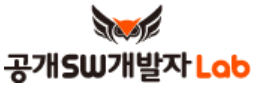

# Hallym-OpenSourceSW.github.io
**한림대학교 [오픈소스 SW](https://github.com/Hallym-OpenSourceSW/Hallym-OpenSourceSW.github.io/blob/master/Sub_menu/WhatisOSS.md) 교육센터**

한림대학교 소프트웨어 중심대학 사업단 산하 오픈소스 소프트웨어 교육 센터 (Hallym OSS Education Center)

**한림대학교 소프트웨어 중심대학의 오픈소스 SW 활성화 전략**
  - [Open Project-Syllabus-Portfolio 생태계 구축](https://github.com/Hallym-OpenSourceSW/Hallym-OpenSourceSW.github.io/blob/master/Sub_menu/open_psp.md)
  - [오픈소스SW 활용 실습 수업 진행](https://github.com/Hallym-OpenSourceSW/HLSWCourses) (2018년 2학기 - 총 23과목에서 활용)
  - [오픈소스SW 개발 중심의 석/박사 과정 운영](https://github.com/Hallym-OpenSourceSW/Hallym-OpenSourceSW.github.io/blob/master/Sub_menu/oss_grad.md)
  - [오픈소스 SW 교육 및 기여 장려를 위한 오픈소스SW 활동 교수 업적화](./Sub_menu/rule.md): (규정 개정: 2018년 12월)

**한림대학교 소프트웨어 중심대학의 오픈소스 SW 사업 운영**
  - [오픈소스 SW 교과목 개발 및 운영](https://github.com/Hallym-OpenSourceSW/Hallym-OpenSourceSW.github.io/blob/master/Sub_menu/ossClass.md) (전공 2과목, 비전공자 2과목, 교재개발 2건)
  - [오픈소스 SW 활용 산학 프로젝트 진행(산학과제/캡스톤)](https://github.com/Hallym-OpenSourceSW/Hallym-OpenSourceSW.github.io/blob/master/Sub_menu/oss-sanhak.md)
  - [오픈소스 SW 세미나 진행](https://github.com/Hallym-OpenSourceSW/Hallym-OpenSourceSW.github.io/blob/master/Sub_menu/ossSeminar.md) (현재 7회)
  - [찾아가는 Git/Github 세미나](https://github.com/Hallym-OpenSourceSW/Hallym-OpenSourceSW.github.io/blob/master/Sub_menu/gitSeminar.md) (4회)
  - [KossLab과 함께하는 오픈소스 실무 전문가 초정 세미나](https://github.com/Hallym-OpenSourceSW/Hallym-OpenSourceSW.github.io/blob/master/Sub_menu/kossLab.md) (3회) 

  - [오픈소스 SW 동아리/커뮤니티 활성화](https://github.com/Hallym-OpenSourceSW/Hallym-OpenSourceSW.github.io/blob/master/Sub_menu/oss_community.md)
     - 오픈소스 SW 동아리 2개: 씨애랑 & [미친러닝](https://github.com/jeonggunlee/MichinLearning)
     - 오픈소스 워크숍, [소프트웨어 카펜트리 워크숍](https://statkclee.github.io/2018-10-27-hallym/?fbclid=IwAR0MOtAW5EAYyg0VCzGXV5njSDntFtRk65ZambRti-lwjfh28LI4aFv2WLc), 한림 데이터랩 (융합전공 커뮤니티)
         * [카펜트리 워크샵 Github](https://github.com/statkclee/2018-10-27-hallym)
     - 오픈소스 SW 동아리 - 씨애랑 소프트웨어 전시회 (소프트웨어 위크 중 진행)
  - [오픈소스 중심의 **"한림 SW 해커톤"** 진행](https://github.com/Hallym-OpenSourceSW/Hallym-OpenSourceSW.github.io/blob/master/Sub_menu/osshack.md) ([한림 SW 해커톤](https://sites.google.com/view/hlsw-hackathon/home))
  - 오픈소스 활용 유도를 위한 **"[한림 SW 공모전](./Sub_menu/sw_contest.md)": 38팀 참여 (2018)** 진행
  - [Github를 통한 오픈 Portfolio Contest](https://github.com/Hallym-OpenSourceSW/GitResumeContest)
     - Github와 친숙해지기 위해 이력서를 Github에 올리고 평가받는 콘테스트 (한림 소프트웨어 위크에 진행)
  - 소프트웨어 빌리지 오픈소스 SW 단기 특강 (R, Linux, Python, Tensorflow, 앱인벤터) --> [링크](http://hlsw.hallym.ac.kr/board/course)
  - 외부 오픈소스 커뮤니티 활동
  
  
**오픈소스 SW 교육센터 Github**: [Github.com/Hallym-OpenSourceSW](Github.com/Hallym-OpenSourceSW)

**News**
  - 2018년 5월 30일: 한림대학교 소프트웨어 중심대학 사업단과 한국공개소프트웨어협의회간 협약이 있었습니다. 앞으로 두기관의 협력으로 우리 한림대학교 소프트웨어 융합대학의 오픈소스 활용이 극대화 되기를 기대합니다. 

* * *

**오픈소스공유 자료**
   - [한림 찾아가는 Git/Github 세미나 - 동영상자료](https://www.youtube.com/playlist?list=PLKZ28p5qq0DFioGVK9Og8VTmHmmosrb8g)
   - [Git과 Github에 관한 짧고도 재밌는 동영상](https://www.youtube.com/playlist?list=PLAHa1zfLtLiPrxoBo9a1HVmauvE2Mn3xX) by 
코드스쿼드
   - [누구나 쉽게 이해할 수 있는 Git 에 입문](https://backlog.com/git-tutorial/kr/)

*  *  *

- [한림대학교 소프트웨어 중심대학 사업단 홈페이지](http://hlsw.hallym.ac.kr/)
- [한림대학교 소프트웨어 중심대학 페이스북 페이지](https://www.facebook.com/HALLYMSOFTWARE/)

